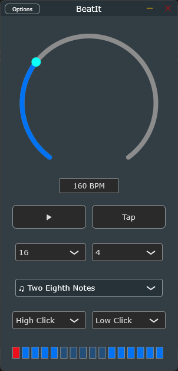

# BeatIt - Multi Platform Metronome Plugin
[](LICENSE)

[]

## Overview

BeatIt is a multi-platform metronome plugin and standalone app built with JUCE framework. CI and CMake come from the incredible [PampleJuce template](https://github.com/sudara/pamplejuce/).
It offers precise timing, extensive customization options, and an intuitive interface that seamlessly integrates into any modern DAW workflow.

## Key Features

- **Precise Tempo Control**: 
  - BPM range: 1-500
  - High-precision tap tempo functionality
  - Visual feedback for active beats

- **Advanced Time Signature Support**:
  - Customizable time signatures
  - Support for complex meters
  - Individual beat muting capabilities

- **Sound Options**:
  - Distinct sound selection for first and subsequent beats
  - High-quality click sounds (1500Hz and 800Hz options)
  - Muting capability for any beat in the pattern

- **Visual Feedback**:
  - Real-time beat visualization
  - Active beat highlighting
  - Clear tempo display

- **DAW Integration**:
  - Full automation support
  - Parameter saving/recall
  - Low CPU usage

## Installation

### System Requirements
- Windows 10/11 or macOS 10.13+
- VST3, LV2, AU, or AAX compatible DAW
- 64-bit system
- Minimum 4GB RAM
- Any CPU from 2015 or newer

### Installation Steps
1. Download the latest release for your platform
2. Run the installer package
3. Restart your DAW
4. The plugin will appear in your DAW's plugin list under "Effects > BeatIt"

## Building from Source

### Prerequisites
- JUCE Framework (8.0.0 or later)
- C++20 compatible compiler
- CMake 3.15 or later
- Git

### Build Instructions

1. Clone the repository:
```bash
git clone --recursive https://github.com/lbartoletti/BeatIt.git
cd BeatIt
```

Using Projucer:
2. Open in Projucer:
- Launch Projucer
- Open `Metronome.jucer`
- Select your IDE and click "Save and Open in IDE"

3. Build the project:
- For Visual Studio: Open the solution and build in Release mode
- For Xcode: Select the target and build
- For Linux: Use the provided Makefile

Using CMake:
2. Open your IDE or build it with `cmake -S . -B build` && `cmake --build build`

## Usage Guide

### Basic Operation

1. **Setting the Tempo**:
   - Drag the BPM slider (range: 1-500)
   - Use mouse wheel for fine adjustments
   - Click the tap tempo button rhythmically

2. **Time Signature Configuration**:
   - Select beats per bar (1-32)
   - Choose beat denominator (1, 2, 4, 8, 16)
   - Choose time signature (quarter, triplet, galop,etc)

3. **Sound Customization**:
   - First beat sound: Select from High/Low click
   - Other beats sound: Independent selection
   - Mute specific beats by clicking their visualizers

### Advanced Features

1. **Beat Pattern Customization**:
   - Click on beat visualizers to mute/unmute
   - Create complex patterns by selective muting
   - Patterns save with your project

2. **Visual Feedback**:
   - Active beats shown in real-time
   - Current position indicator
   - Beat intensity visualization

## Technical Documentation

### Core Components

#### MetronomeAudioProcessor
The main processing class handling:
- Audio generation and timing
- Parameter management
- State persistence
- Beat pattern processing

Key methods:
```cpp
void prepareToPlay(double sampleRate, int samplesPerBlock)
void processBlock(juce::AudioBuffer<float>&, juce::MidiBuffer&)
void updateTimingInfo()
bool isBeatMuted(int beatIndex)
```

#### MetronomeAudioProcessorEditor
The UI component providing:
- Visual interface
- User interaction handling
- Real-time display updates
- Control binding

Key methods:
```cpp
void paint(juce::Graphics&)
void updateBeatVisualizers()
void handleBeatVisualizerClick(int beatIndex)
```

### Audio Architecture

1. **Click Sound Generation**:
- High click: 1500 Hz, 30ms duration
- Low click: 800 Hz, 20ms duration
- Applied envelope shaping for clean sound

2. **Timing System**:
- Sample-accurate beat timing
- Adaptive sample rate handling
- Internal position tracking

### Performance Considerations

- Optimized click sound generation
- Minimal CPU usage during playback
- Zero-latency operation
- Efficient state management

## Contributing

We welcome contributions! Please follow these steps:

1. Fork the repository
2. Create a feature branch
3. Implement your changes
4. Add tests if applicable
5. Submit a pull request

### Code Style Guidelines
- Follow JUCE coding standards
- Use meaningful variable names
- Comment complex algorithms
- Include documentation for public methods

## License

This project is licensed under the MIT License - see the [LICENSE](LICENSE) file for details.

## Support

- GitHub Issues: Bug reports and feature requests

---

© 2024 BeatIt Plugin. All rights reserved.